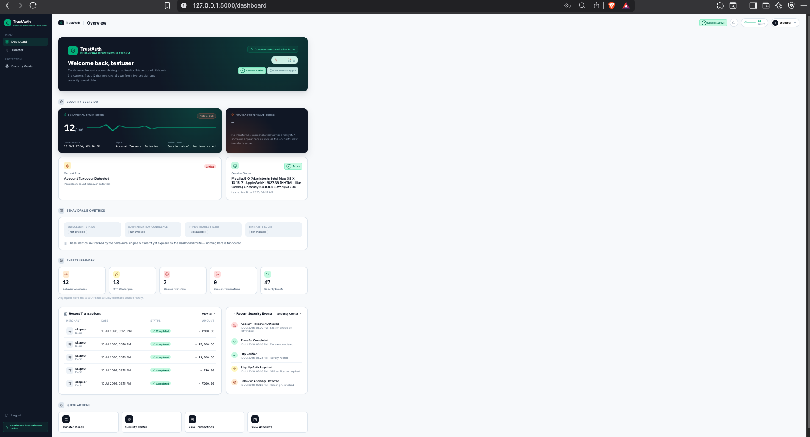
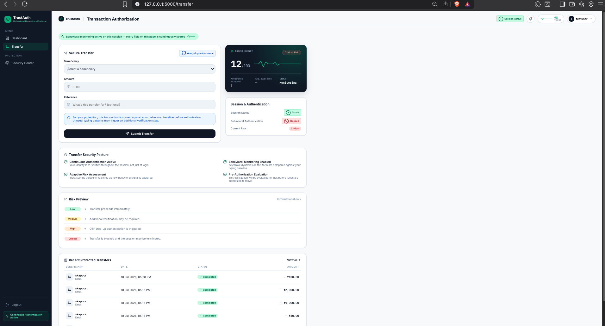
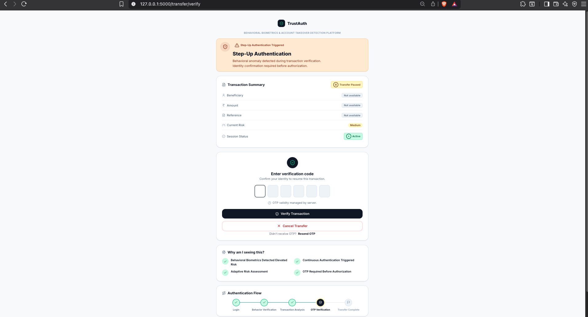
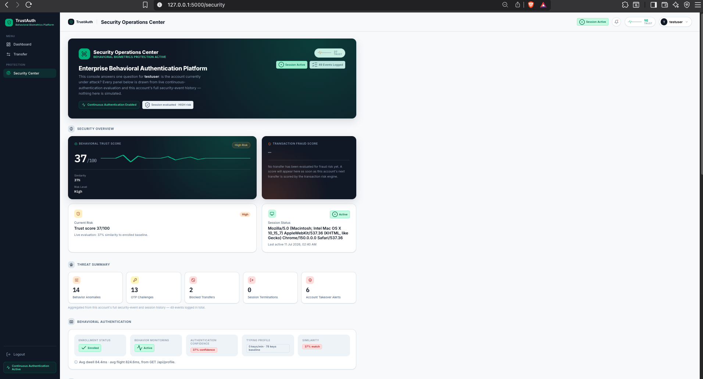
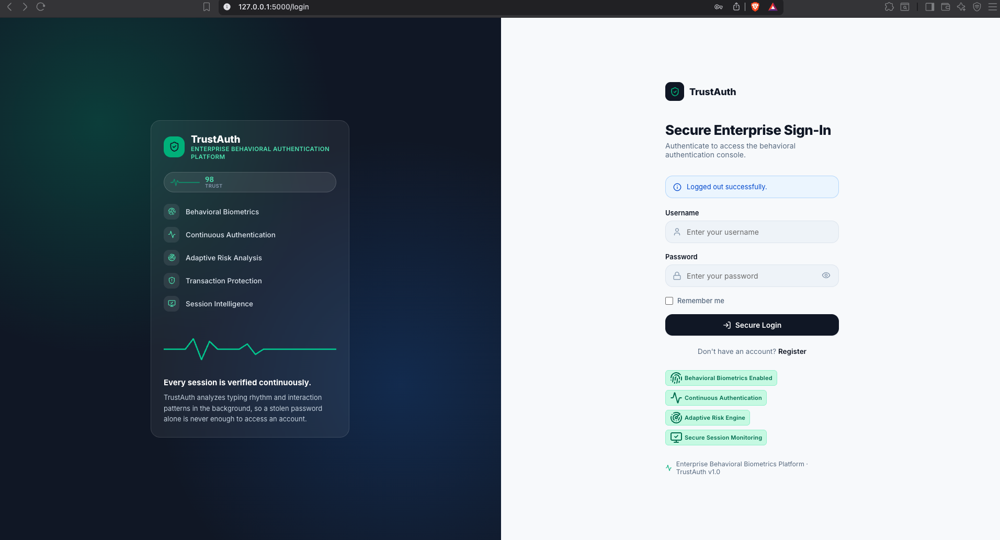
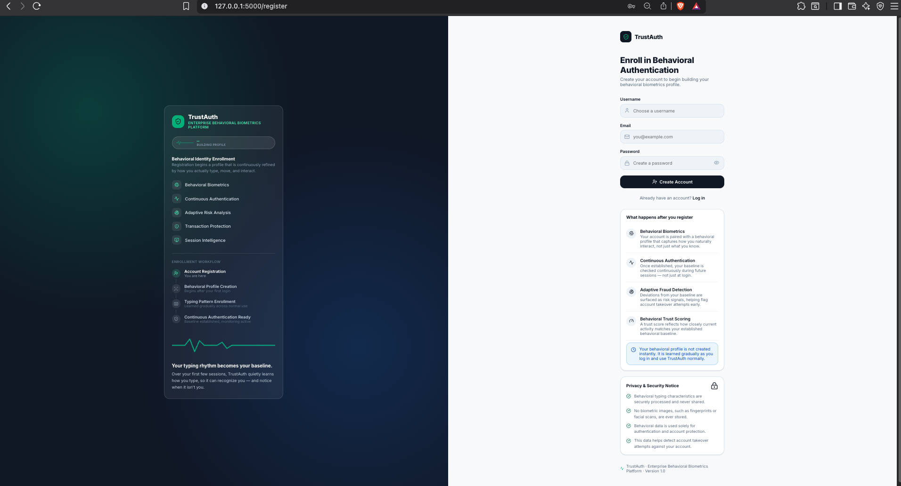
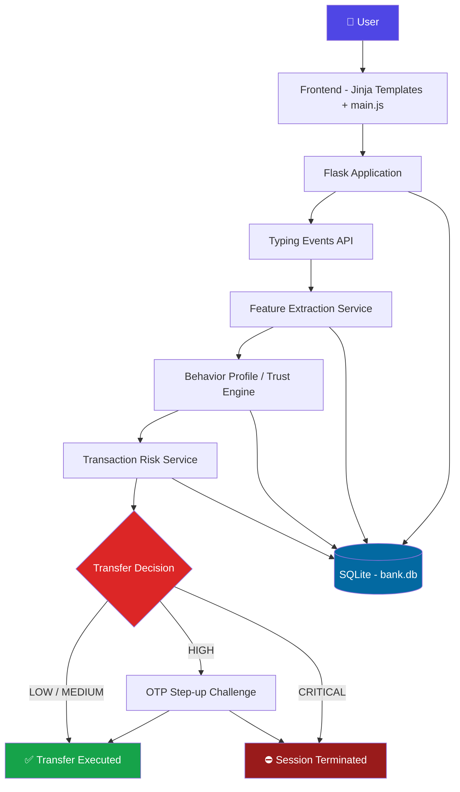
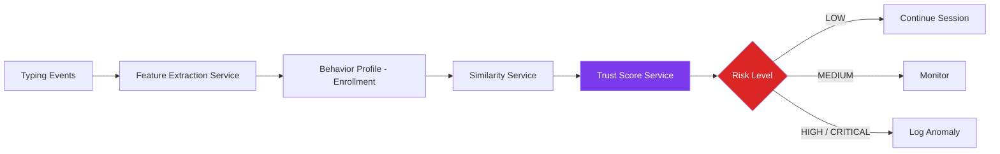
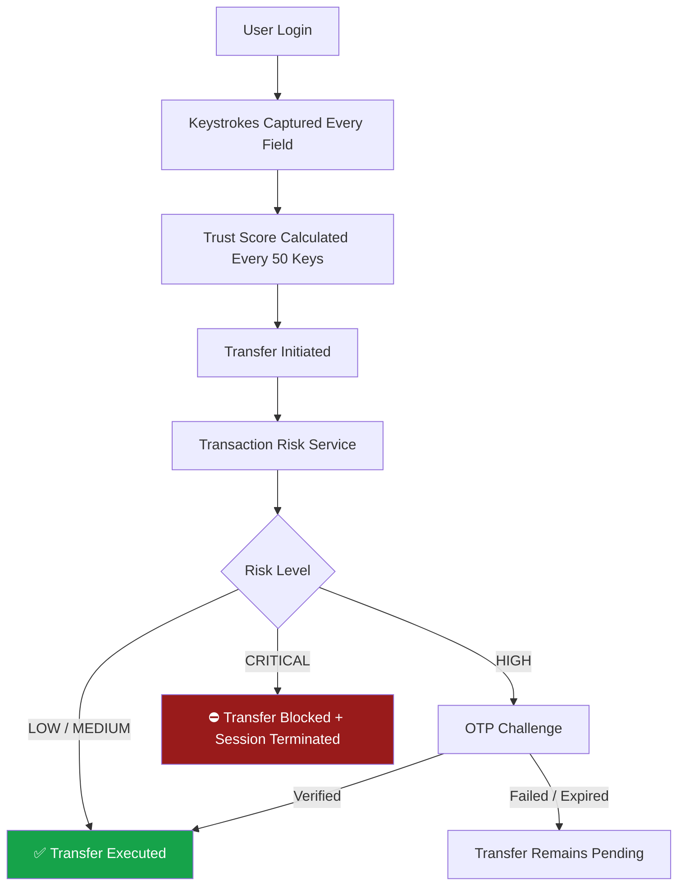

<div align="center">

# 🛡️ TrustAuth

### Behavioral Biometrics powered Banking Account Takeover Detection Platform

[](https://www.python.org/)
[](https://flask.palletsprojects.com/)
[](https://www.sqlite.org/)
[](https://scikit-learn.org/)
[](#)
[](#)
[](#license)

</div>

> **⚠️ Disclaimer:** TrustAuth is **not** an online banking application. It is an enterprise cybersecurity **research and demonstration platform** built to showcase Continuous Authentication using Behavioral Biometrics for detecting Banking Account Takeover (ATO). No real financial systems, funds, or customer data are involved.

---

## 📖 Overview

Passwords were never designed to prove *who* is typing them — only that *someone* knows a string of characters. Once a credential is phished, leaked in a data breach, or reused across services, a password stops being a meaningful identity signal. Adding an OTP at login helps, but it suffers from the same fundamental flaw: it verifies identity **once**, at a single point in time, and then trusts the session indefinitely.

This is exactly the gap attackers exploit in modern Account Takeover (ATO) fraud. A session hijacked through malware, a stolen cookie, or a social-engineered OTP is treated by most systems as fully legitimate for its entire lifetime — because authentication was only ever checked at the door.

**Behavioral Biometrics** offers a different approach. Instead of asking "did you know the right password?", it asks "does the way you are interacting with this application match how *you* normally interact with it?" TrustAuth builds this profile from **keystroke dynamics** — dwell time, flight time, typing speed, and their variance — captured while the user types into the login, register, and transfer forms.

TrustAuth is built around the idea that authentication is not a single event, it's a **continuous process**. Keystrokes are streamed to the backend as the user types, an enrolled behavioral profile is built once enough samples exist, and every subsequent batch of keystrokes is compared against that profile to produce a live Trust Score. When a fund transfer is initiated, that Trust Score feeds into a separate transaction risk calculation that decides whether to allow the transfer, require step-up OTP verification, or terminate the session outright.

---

## 🎯 Problem Statement

```
Traditional Authentication
        │
        ▼
   Login Succeeds
        │
        ▼
No Further Identity Verification
        │
        ▼
   Account Takeover
```

Most authentication systems are front-loaded: all the security effort happens at login, and none of it afterward. Once a session is established, the system implicitly trusts every action taken within it — regardless of whether the behavior driving those actions is consistent with the original user.

**How TrustAuth addresses this:**

TrustAuth removes the assumption that a session remains trustworthy simply because it started with valid credentials. It continuously captures keystroke events during the session, extracts dwell-time and flight-time features, compares them against a stored behavioral profile, and produces a Trust Score every 50 keystrokes. When a transfer is initiated, that Trust Score is combined with transaction-specific signals (amount, balance percentage, new beneficiary, transfer velocity) to decide whether to allow, monitor, challenge with OTP, or block the transaction and terminate the session — closing the exact gap that enables ATO.

---

## ✨ Key Features

| Feature | Description |
|---|---|
| 🔄 **Continuous Authentication** | Behavior is re-evaluated every 50 keystrokes during an active session, not just at login |
| ⌨️ **Keystroke Dynamics** | Captures key-down/key-up timestamps, dwell time, and flight time per field |
| 🧬 **Behavioral Biometrics** | Builds a per-user profile (avg/variance of dwell time, flight time, typing speed) once enough keystrokes are collected |
| 📊 **Trust Score** | Similarity between live typing behavior and the enrolled profile, expressed as a 0–100 score |
| ⚖️ **Adaptive Risk Engine** | Combines behavioral trust with transaction amount, balance percentage, beneficiary history, and transfer velocity |
| 🔐 **Step-up Authentication (OTP)** | A 6-digit, time-limited OTP is generated and required when a transfer is flagged HIGH risk |
| 👁️ **Session Monitoring** | Tracks login time, last activity, IP address, device info, and session status (ACTIVE / ENDED / TERMINATED) |
| 🕒 **Security Timeline** | Security Center page lists logged security events in chronological order |
| 💸 **Transaction Risk Analysis** | Scores every transfer on behavior, amount, balance, beneficiary, and velocity before it executes |
| 🖥️ **Enterprise Dashboard** | Displays account balance and recent transactions for the logged-in user |
| 🛡️ **Security Center** | Dedicated page for reviewing security events raised during the session |
| 📝 **Behavioral Event Logging** | Every keystroke and every security decision is persisted to SQLite for later review |

---

## 🖼️ Screenshots

> Screenshots are placeholders — add captures from your running instance to `docs/screenshots/` and update the paths below.

| Dashboard | Transfer Page |
|---|---|
|  |  |

| OTP Verification | Security Center |
|---|---|
|  |  |

| Login | Register |
|---|---|
|  |  |

---

## 🏗️ System Architecture



Routing is split across four Flask blueprints — `auth`, `main`, `transfer`, and `api` — registered in `app/__init__.py`. An `app/dashboard` blueprint exists in the codebase but currently has no routes defined and is not registered on the app.

---

## 🔬 Behavioral Authentication Flow



Each key press and release on the login, register, and transfer forms is captured client-side by `main.js` and sent to `/api/typing`. `feature_extraction_service.py` turns the stored `TypingEvent` rows for a session into five features: average dwell time, average flight time, dwell-time variance, flight-time variance, and typing speed.

Once a user has enough recorded keystrokes, `profile_service.py` creates a `BehaviorProfile` baseline from those features (this enrollment threshold is currently set low for development and is called out directly in the code comments). From then on, `similarity_service.py` compares each new batch of features against the stored profile using a percentage-difference calculation, and `trust_score_service.py` converts that similarity into a Trust Score with a risk band of `LOW` (≥90), `MEDIUM` (≥70), or `HIGH` (<70).

The repository also includes an offline machine learning pipeline (`ml/train_model.py`, `ml/feature_engineering.py`, `ml/preprocess.py`) that trains a scikit-learn `RandomForestClassifier` on the public CMU keystroke-dynamics dataset (`DSL-StrongPasswordData.csv`) and saves it as `random_forest_model.joblib`. This model is trained and persisted, but `ml/predict.py` is currently empty — the live Trust Engine uses the statistical similarity approach described above rather than this classifier.

---

## 📁 Project Structure

```
TrustAuth/
│
├── app/
│   ├── __init__.py                # create_app(), blueprint registration
│   ├── config.py                  # Flask config, SQLite URI
│   ├── extensions.py              # db, login_manager, bcrypt
│   │
│   ├── auth/                      # auth blueprint
│   │   ├── routes.py              # /, /register, /login, /logout
│   │   └── forms.py
│   │
│   ├── main/                      # main blueprint
│   │   └── routes.py              # /dashboard, /security, /accounts, /transactions
│   │
│   ├── transfer/                  # transfer blueprint
│   │   └── routes.py              # /transfer, /transfer/verify, /transfer/resend, /transfer/cancel
│   │
│   ├── api/                       # api blueprint (url_prefix=/api)
│   │   └── routes.py              # /typing, /features, /security-events, /profile, /trust
│   │
│   ├── dashboard/                 # scaffolded blueprint, no routes defined, not registered
│   │
│   ├── static/
│   │   ├── css/style.css
│   │   └── js/main.js             # keystroke capture + UI interactions
│   │
│   └── templates/
│       ├── base.html
│       ├── login.html
│       ├── register.html
│       ├── dashboard.html
│       ├── transfer.html
│       ├── verify_transfer_otp.html
│       └── security.html
│
├── models/
│   ├── user.py                    # User
│   ├── user_session.py            # UserSession
│   ├── typing_event.py            # TypingEvent
│   ├── behavior_profile.py        # BehaviorProfile
│   ├── security_event.py          # SecurityEvent
│   ├── bank_account.py            # BankAccount
│   ├── transaction.py             # Transaction
│   └── transfer_otp.py            # TransferOTP
│
├── services/
│   ├── auth_service.py
│   ├── session_service.py
│   ├── typing_service.py
│   ├── feature_extraction_service.py
│   ├── profile_service.py
│   ├── enrollment_service.py
│   ├── similarity_service.py
│   ├── trust_score_service.py
│   ├── trust_engine.py
│   ├── continuous_auth_service.py
│   ├── auth_decision_service.py
│   ├── verification_service.py
│   ├── transaction_risk_service.py
│   ├── transfer_service.py
│   ├── otp_service.py
│   ├── security_event_service.py
│   └── dashboard_service.py
│
├── ml/
│   ├── dataset/DSL-StrongPasswordData.csv
│   ├── preprocess.py
│   ├── feature_engineering.py
│   ├── train_model.py
│   ├── predict.py                 # currently empty / not wired in
│   └── saved_model/
│       ├── random_forest_model.joblib
│       └── label_encoder.joblib
│
├── utils/
│   └── statistics.py               # mean / variance / typing speed helpers
│
├── database/
│   └── bank.db                     # SQLite database
│
├── assets/, data/, docs/, instance/, logs/, tests/   # present in the repo, currently empty
│
├── create_db.py                    # db.create_all() bootstrap script
├── requirements.txt
├── run.py
└── README.md
```

---

## 🧰 Technology Stack

**Frontend**
- HTML (Jinja2 templates)
- CSS
- JavaScript (vanilla — keystroke capture, sidebar, dropdowns, flash toasts)

**Backend**
- Python
- Flask
- Flask-Login (session/auth management)
- Flask-Bcrypt (password hashing)
- Flask-SQLAlchemy (ORM)

**Database**
- SQLite (`database/bank.db`)

**Machine Learning**
- scikit-learn (`RandomForestClassifier`, trained offline on a public keystroke-dynamics dataset)
- pandas / numpy (feature engineering)

**Security**
- Behavioral Biometrics
- Keystroke Dynamics
- Continuous Authentication
- Multi-factor transaction risk scoring

---

## ⚙️ Installation

```bash
# 1. Clone the repository
git clone https://github.com/<your-username>/TrustAuth.git
cd TrustAuth

# 2. Create a virtual environment
python -m venv venv
source venv/bin/activate      # On Windows: venv\Scripts\activate

# 3. Install dependencies
pip install -r requirements.txt

# 4. Initialize the database
python create_db.py

# 5. Run the application
python run.py
```

The application will be available at `http://127.0.0.1:5000`.

---

## 🔌 API Endpoints

All API routes are registered under the `api` blueprint with the `/api` prefix and require an authenticated session.

| Method | Endpoint | Description |
|---|---|---|
| `POST` | `/api/typing` | Submit a captured keystroke event; triggers continuous auth evaluation every 50 keystrokes |
| `GET` | `/api/features` | Return extracted behavioral features for the current active session |
| `GET` | `/api/profile` | Return the user's behavioral profile, enrolling it if enough keystrokes exist |
| `GET` | `/api/trust` | Return the current Trust Score, similarity, and risk level for the active session |
| `GET` | `/api/security-events` | Return the user's logged security events, most recent first |

Page routes (not JSON APIs) are split across the other blueprints:

| Blueprint | Route | Description |
|---|---|---|
| `auth` | `GET /` | Redirects to dashboard or login depending on auth state |
| `auth` | `GET/POST /register` | User registration (also creates a `BankAccount`) |
| `auth` | `GET/POST /login` | User login, opens a new `UserSession` |
| `auth` | `GET /logout` | Ends the active session and logs out |
| `main` | `GET /dashboard` | Account balance and recent transactions |
| `main` | `GET /security` | Security Center — lists security events |
| `main` | `GET /accounts` | Placeholder page ("Coming Soon") |
| `main` | `GET /transactions` | Placeholder page ("Coming Soon") |
| `transfer` | `GET/POST /transfer` | Initiate a transfer; may redirect to OTP verification |
| `transfer` | `GET/POST /transfer/verify` | Verify the step-up OTP for a pending transfer |
| `transfer` | `POST /transfer/resend` | Resend a fresh OTP for the pending transfer |
| `transfer` | `POST /transfer/cancel` | Cancel a pending transfer awaiting OTP |

---

## 🔐 Security Workflow



`transaction_risk_service.py` combines five weighted signals into a single score: a behavior score derived from the Trust Score, a transfer-amount score, a percentage-of-balance score, a new-beneficiary score, and a transaction-velocity score (repeated transfers within a 5-minute window). The combined score maps to `LOW`, `MEDIUM`, `HIGH`, or `CRITICAL`, which in turn decides whether `transfer_service.py` executes the transfer, generates an OTP via `otp_service.py`, or terminates the session via `session_service.py`.

---

## 🚀 Future Improvements

- [ ] Wire the trained Random Forest classifier (`ml/saved_model/random_forest_model.joblib`) into the live Trust Engine via `ml/predict.py`
- [ ] Persistent Trust Score / risk history and trend visualization
- [ ] Real-time dashboard updates (WebSocket or polling) instead of on-demand API calls
- [ ] Device fingerprinting as an additional risk signal
- [ ] Location intelligence for geo-based anomaly detection
- [ ] Scheduled retraining pipeline for the keystroke-dynamics model
- [ ] Implement the `accounts` and `transactions` pages beyond their current placeholders
- [ ] Register or remove the unused `app/dashboard` blueprint

---

## 🎓 Learning Outcomes

This project was built to explore the intersection of applied machine learning and practical cybersecurity engineering. It demonstrates:

- Designing and structuring a full-stack **Flask** application with blueprints and Flask-SQLAlchemy models
- Building an offline **machine learning** pipeline (preprocessing, feature engineering, training, evaluation) with scikit-learn
- Implementing **Behavioral Biometrics** and keystroke dynamics from raw key-down/key-up event data
- Applying **Continuous Authentication** principles beyond a traditional login-only check
- Building a multi-factor **Risk Analysis** engine for transaction-level fraud scoring
- Core **cybersecurity** concepts around session management, step-up OTP verification, and Account Takeover detection
- Designing an **enterprise-style UI** for banking dashboards, transfer flows, and a security event timeline

---

## 👤 Author

**Raunit Chatterjee**
Cybersecurity Student, Manipal University Jaipur

[](https://github.com/<your-username>)
[](https://linkedin.com/in/<your-linkedin>)

---

## 📄 License

This project is licensed under the **MIT License** 

<div align="center">

*Built as a research and educational demonstration of behavioral biometrics in cybersecurity.*

</div>